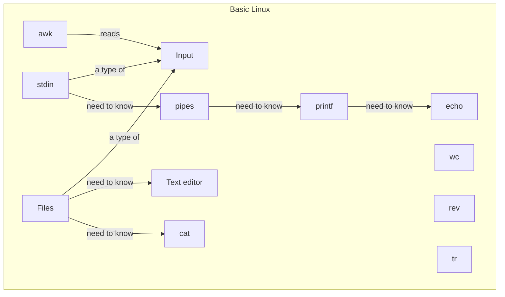

# Basic Linux

!!!- info "Learning objectives"

    - Practice some basic Linux commands: `echo`, `printf`, `cat`, `wc`, `rev`
    - Practice with Linux pipes
    - Use the output of one process as the input for `awk`

???- question "For teachers"

    Teaching goals are:

    - The learners have practiced with UNIX pipes

    Lesson plan:

    * 5 mins: prior knowledge
    * 5 mins: presentation
    * 15 mins: challenge
    * 5 mins: feedback

## Overview

Most UNIX (i.e. Linux and MacOS) distributions includes `awk` 
as it is a [tool](https://en.wikipedia.org/wiki/List_of_POSIX_commands)
that is part of [a common standard for what operating systems should have](https://en.wikipedia.org/wiki/Single_UNIX_Specification).
The UPPMAX clusters, running Linux, also have `awk`.

Here we discuss the most relevant Linux programs and terms.



## Exercises

See the exercise procedure [here](../misc/exercise_procedure.md).

### Exercise 1: `echo`

!!!- info "Learning objectives"

    - Use `echo`

Read:

- [The top part of the Wikipedia about page on 'echo'](https://en.wikipedia.org/wiki/Echo_(command))

Do, in a terminal:

- `man echo`
- `echo hello`
- `echo hello world`
- `echo hello\nworld`
- `echo hello\\nworld`
- `echo -e hello\nworld`
- `echo -e hello\\nworld`
- `echo "Hello world"`
- `echo -e "Hello\\nworld"`
- `echo -e 'Hello\\nworld'`

Answer the following questions:

- `echo` can create output that spans multiple lines yes/no
- When putting a newline in a string, the type of quotes (i.e. single or double) matters yes/no

Express in your own words: what does `echo` do?

### Exercise 2: `printf`

!!!- info "Learning objectives"

    - Use `printf`

Read:

- [The top part of the Wikipedia about page on 'printf'](https://en.wikipedia.org/wiki/Printf_(Unix))

Do, in a terminal:

- `man printf`
- `printf hello`
- `printf hello\n`
- `printf hello\\n`
- `printf hello world`
- `printf hello\nworld`
- `printf hello\\nworld`
- `printf -e hello\nworld`
- `printf -e hello\\nworld`
- `printf "Hello world"`
- `printf -e "Hello\\nworld"`
- `printf -e 'Hello\\nworld'`

Answer the following questions:

- `printf` can create output that spans multiple lines yes/no
- When putting a newline in a string, the type of quotes (i.e. single or double) matters yes/no

Express in your own words: what does `printf` do?

### Exercise 3: `cat`

!!!- info "Learning objectives"

    - Use `cat`

Read:

- [The top part of the Wikipedia about page on 'cat'](https://en.wikipedia.org/wiki/Cat_(Unix))

Do:

- create a file called `why_awk.txt` with the following content (from [here](https://web.archive.org/web/20160324050308/http://awk.info/?whygawk)):

```title="why_awk.txt"
 "The Enlightened Ones say that....

    You should never use C if you can do it with a script;
    You should never use a script if you can do it with awk;
    Never use awk if you can do it with sed;
    Never use sed if you can do it with grep." 

```

Then, in a terminal, in the same folder as `why_awk.txt`, do:

- `man cat`
- `cat why_awk.txt`
- `cat -b why_awk.txt`
- `cat -n why_awk.txt`

Express in your own words: what does `cat` do?

### Exercise 4: `wc`

!!!- info "Learning objectives"

    - Use `wc`

Read:

- [The top part of the Wikipedia about page on 'wc'](https://en.wikipedia.org/wiki/Wc_(Unix))

Then, in a terminal, do:

- `man wc`
- `wc why_awk.txt`

Express in your own words: what does `wc` do?

### Exercise 5: a UNIX pipeline

!!!- info "Learning objectives"

    - Use a pipeline

Read:

- [The top part of the Wikipedia about a UNIX pipeline](https://en.wikipedia.org/wiki/Pipeline_(Unix))

The pipe symbol `|` is used in a UNIX pipeline.

Do, in a terminal:

- `echo hello world | rev`
- `echo hello world | rev | rev` 
- `cat why_awk.txt | wc` 
- `cat why_awk.txt | rev` 
- `cat why_awk.txt | wc | rev` 
- `cat -n why_awk.txt | rev` 
- `rev --version | rev` 

Express in your own words: what does the pipe symbol `|` do?
