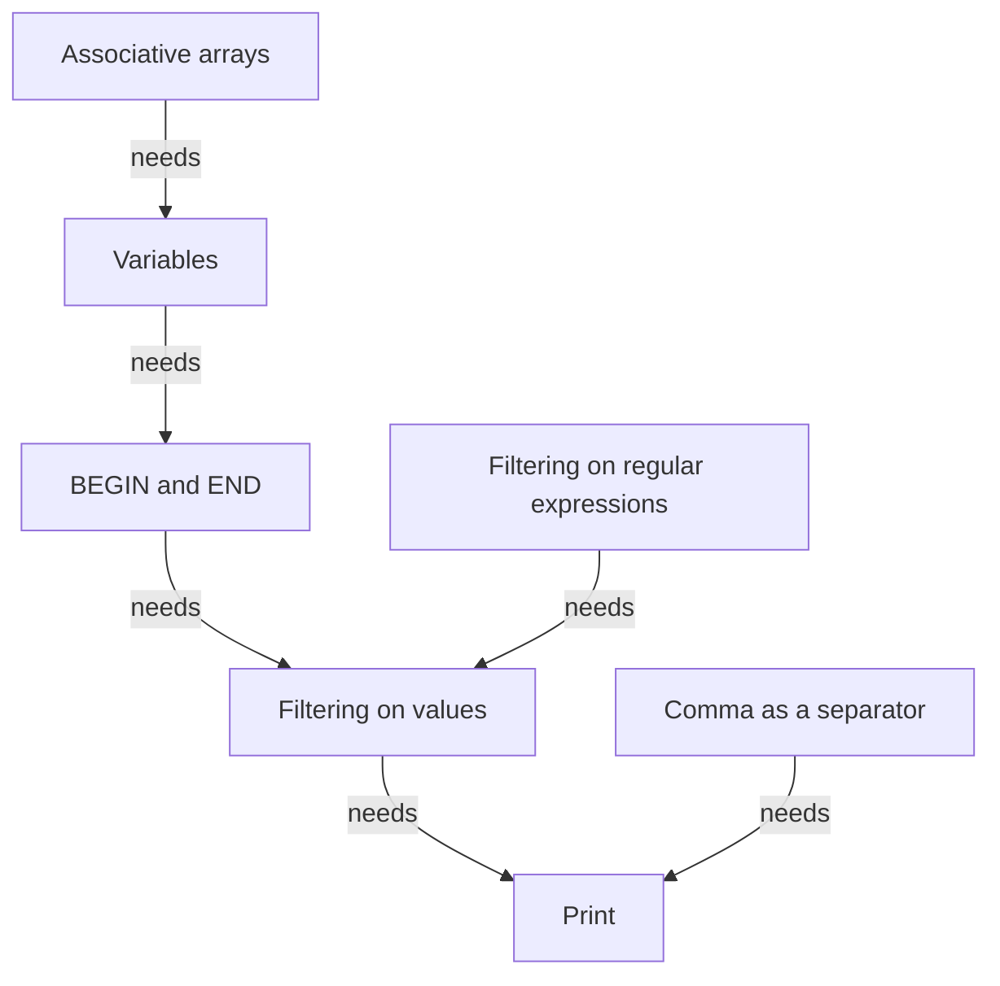

# AWK course

This module introduces the fundamentals of the AWK language. 

!!! info "Content"

    This is the teaching material for the UPPMAX AWK course.

    This repository is based on the material of <https://pmitev.github.io/to-awk-or-not/>
    and puts it into teaching cycles.
    
## Schedule

Time          | Topic
--------------|-------------------------------
13:00-14:00   | [Regular expressions](regexps.md)
14:00-14:15   | Break
14:15-15:00   | [What is AWK](what_is_awk.md), [Basic Linux](basic_linux.md)
15:00-16:00   | Break
15:15-16:00   | [Related tools](related_tools.md)

## Overview

## Links

 * [CLI text processing with GNU awk](https://learnbyexample.github.io/learn_gnuawk/): a book we use
 * [To awk or not](https://pmitev.github.io/to-awk-or-not): course material we use

