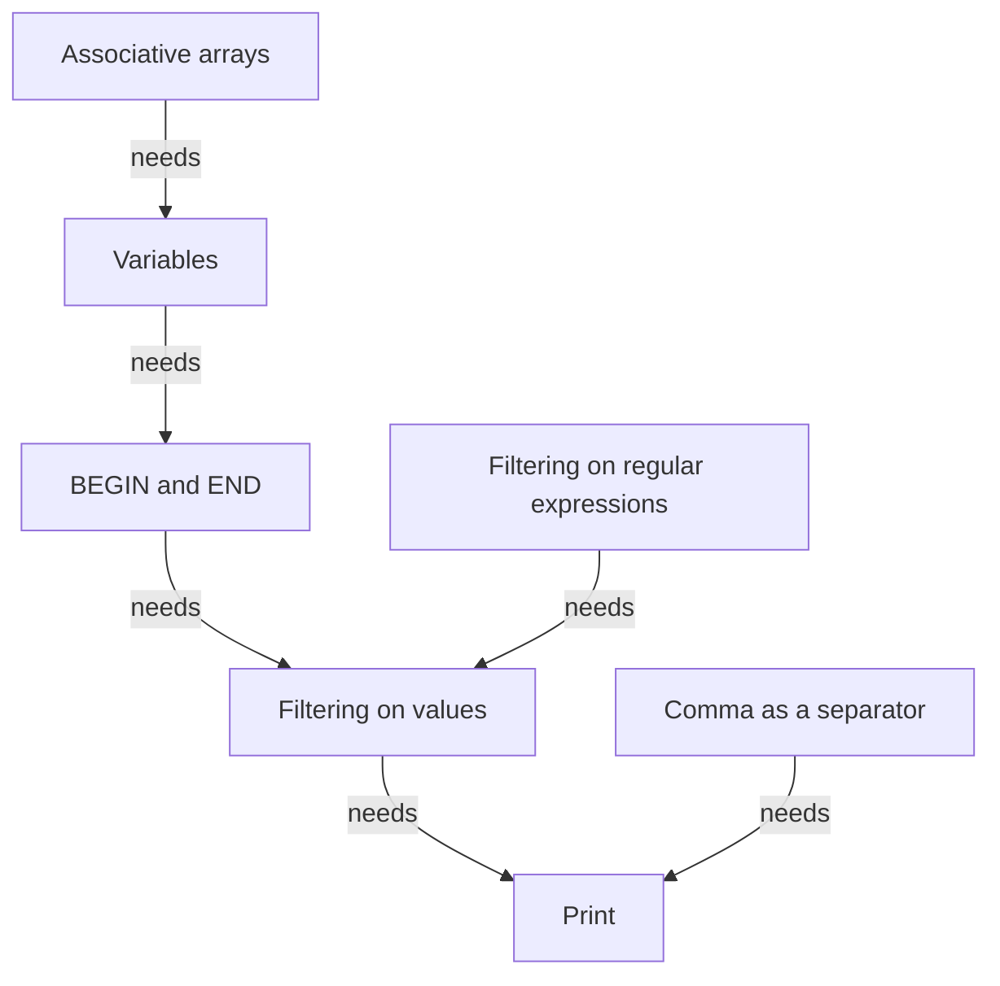
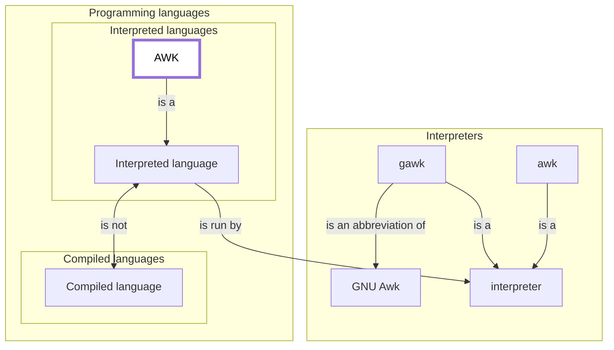
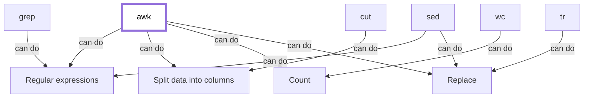

# AWK course

This module introduces the fundamentals of the AWK language. 

!!! info "Content"

    This is the teaching material for the UPPMAX AWK course.

    This repository is based on the material of <https://pmitev.github.io/to-awk-or-not/>
    and puts it into teaching cycles.
    
## Schedule

Time          | Topic
--------------|-------------------------------
13:15-14:00   | [Regular expressions](regexps.md)
14:00-14:15   | Break
14:15-15:00   | [What is AWK](what_is_awk.md), [Basic Linux](basic_linux.md)
15:00-16:00   | Break
15:15-16:00   | [Related tools](related_tools.md)

Extra material:

- [Built-in functions](https://learnbyexample.github.io/learn_gnuawk/built-in-functions.html)
- [Record separators](https://learnbyexample.github.io/learn_gnuawk/record-separators.html)
- [In-place file editing](https://learnbyexample.github.io/learn_gnuawk/in-place-file-editing.html)
- [Multiple-file input](https://learnbyexample.github.io/learn_gnuawk/multiple-file-input.html)

## Overview

### Facets of AWK

### AWK as a programming language

### AWK and its friends

## Links

 * [CLI text processing with GNU awk](https://learnbyexample.github.io/learn_gnuawk/): a book we use
 * [To awk or not](https://pmitev.github.io/to-awk-or-not): course material we use
 * [AWK cheat sheet](https://catonmat.net/ftp/awk.cheat.sheet.txt)
