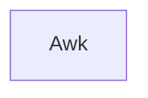

# awk_course

This is the teaching material for the UPPMAX Awk course.

This repository is based on the material of <https://pmitev.github.io/to-awk-or-not/>
and puts it into teaching cycles.

 * [FAQ](faq.md)

## Overview

