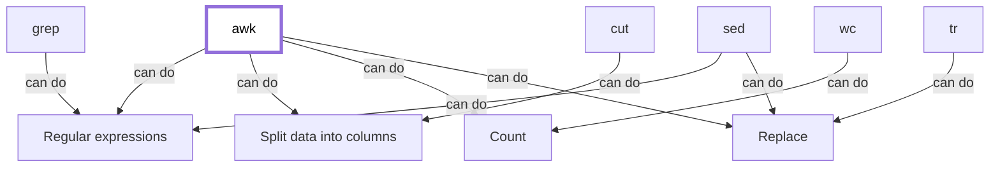

# Related tools

!!!- info "Learning objectives"

    - Hear about the tools similar to `awk`

???- question "For teachers"

    Teaching goals are:

    - Show the tools similar to `awk`

    Lesson plan:

    * 5 mins: prior knowledge
    * 5 mins: presentation
    * ? mins: challenge
    * 5 mins: feedback

## Overview

In this session, we learn about the Linux tools related to `awk`.



Tool    |Regular expressions|Split data into columns|Replace|Count
--------|-------------------|-----------------------|-------|-----
`awk`   |Yes                |Yes                    |Yes    |Yes
`cut`   |No                 |Yes                    |No     |No
`grep`  |Yes                |No                     |No     |Yes
`sed`   |Yes                |Yes                    |Yes    |Yes
`tr`    |No                 |No                     |Yes    |No
`wc`    |No                 |No                     |No     |Yes

> An overview what tools can do by themselves.

Note that most tools are not intended to do all by themselves.
Instead, they are intended to do one thing well and be
part of pipelines.

## Exercises

See the exercise procedure [here](../misc/exercise_procedure.md).

### Exercise 1: `cut`

!!!- info "Learning objectives"

    - Use `cut`

Read:

- [The top part of the Wikipedia about page on 'cut'](https://en.wikipedia.org/wiki/Cut_(Unix))

In a terminal, do:

```
wget https://raw.githubusercontent.com/richelbilderbeek/awk_course/master/data/diamonds_raw.csv
```

to download a file called `diamonds_raw.csv`.

Then, in a terminal, do:

- `man cut`
- `cut -d "," -f 2 diamonds_raw.csv`
- `cat diamonds_raw.csv | cut -d "," -f 2 `

Express in your own words: what does `cut` do?

### Exercise 2: `grep`

!!!- info "Learning objectives"

    - Use `grep`

Read:

- [The top part of the Wikipedia about page on 'grep'](https://en.wikipedia.org/wiki/Grep)

In a terminal, do:

```
wget https://github.com/devstronomy/nasa-data-scraper/raw/master/data/csv/satellites.csv
```

to download a file called `satellites.csv`.

Then, in a terminal, do:

- `man cut`
- `grep om satellites.csv`
- `cat satellites.csv | grep [^aeiou]om`

Express in your own words: what does `grep` do?

### Exercise 3: `sed`

!!!- info "Learning objectives"

    - Use `sed`

Read:

- [The top part of the Wikipedia about page on 'sed'](https://en.wikipedia.org/wiki/Sed)

In a terminal, do:

```
wget https://www.gutenberg.org/cache/epub/1787/pg1787.txt
```

to download a file called `pg1787.txt`.

Then, in a terminal, do:

- `man sed`
- `sed 's/Hamlet/Frederik X/g' pg1787.txt`
- `sed 's/Hamlet/Frederik X/g' pg1787.txt | awk '/Frederik X/'`
- `sed 's/Hamlet/Frederik X/' pg1787.txt | awk '/Frederik X/'`

Express in your own words: what does `sed` do?

### Exercise 4: `tr`

!!!- info "Learning objectives"

    - Use `tr`

Read:

- [The top part of the Wikipedia about page on 'tr'](https://en.wikipedia.org/wiki/Tr_(Unix))

Then, in a terminal, do:

- `man tr`
- `echo "Hello" | tr -s e a`
- `echo "Hello" | tr -d e`
- `echo "Hello world" | tr -d aeiou`

Express in your own words: what does `tr` do?

### Exercise 5: `wc`

!!!- info "Learning objectives"

    - Use `wc`

Read:

- [The top part of the Wikipedia about page on 'wc'](https://en.wikipedia.org/wiki/Wc_(Unix))

In a terminal, do:

```
wget https://www.gutenberg.org/cache/epub/1787/pg1787.txt
```

to download a file called `pg1787.txt`.

Then, in a terminal, do:

- `man sed`
- `wc pg1787.txt`
- `wc pg1787.txt --lines`
- `wc pg1787.txt --words`
- `awk '/Hamlet/' pg1787.txt | wc --lines`


Express in your own words: what does `wc` do?
