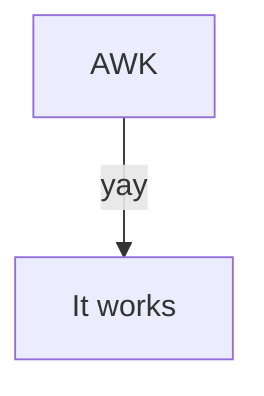

# AWK course

This module introduces the fundamentals of the AWK language. 

!!! info "Content"

    This is the teaching material for the UPPMAX AWK course.

    This repository is based on the material of <https://pmitev.github.io/to-awk-or-not/>
    and puts it into teaching cycles.
    
## Schedule

Time          | Topic
--------------|-------------------------------
09:00-10:00   | [What is AWK](what_is_awk.md), [When to use AWK](when_to_use_awk.md) [simple examples](simple_examples.md)
10:00-10:15   | Break
10:15-11:00   | .
11:00-11:15   | Break
11:15-12:00   | .

## Overview

