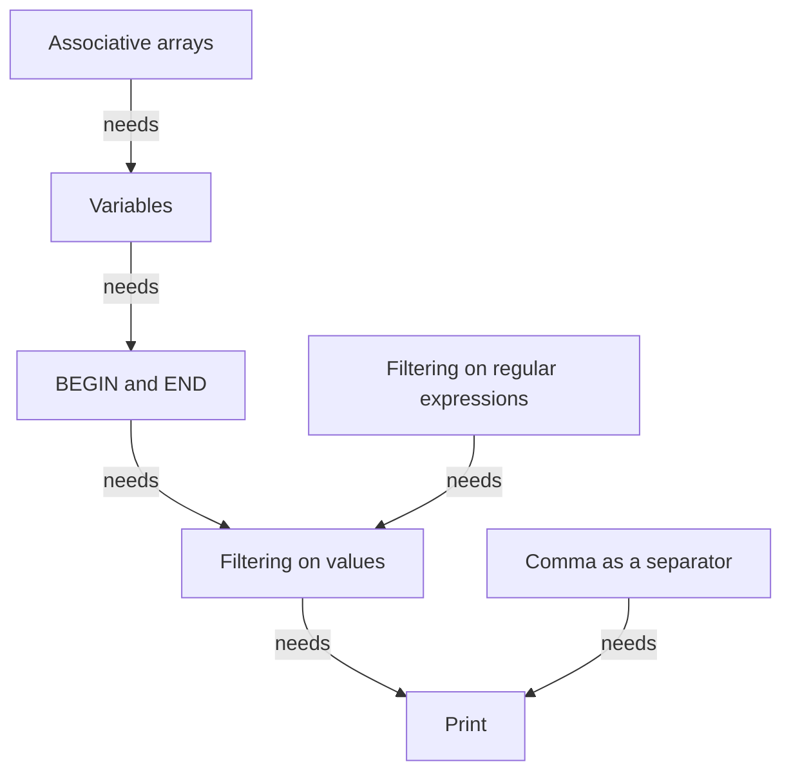

# AWK course

This module introduces the fundamentals of the AWK language. 
    
## Schedule

Time          | Topic
--------------|-------------------------------
09:15-10:00   | [print](print.md), [filtering on values](filtering_on_values.md)
10:00-10:15   | Break
10:15-11:00   | [BEGIN and END](begin_and_end.md), [variables](variables.md)
11:00-11:15   | Break
11:15-12:00   | [Associative arrays](associative_arrays.md), [working with comma-separated values](working_with_csvs.md)

## Overview

## Links

 * [CLI text processing with GNU awk](https://learnbyexample.github.io/learn_gnuawk/)
 * [To awk or not](https://pmitev.github.io/to-awk-or-not)
