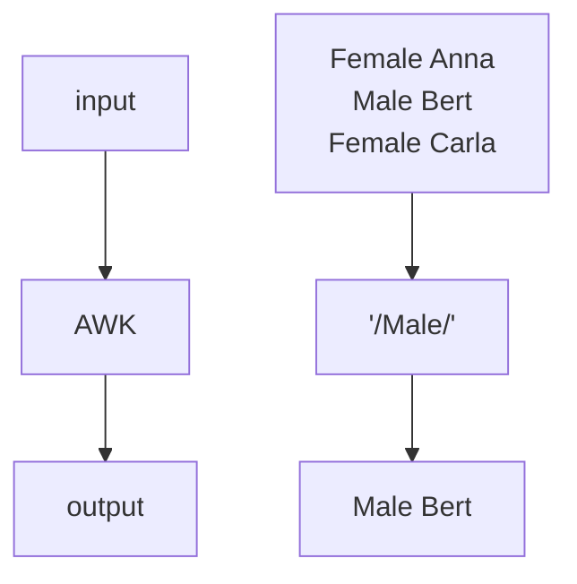

# What is AWK

!!!- info "Learning objectives"

    - to understand what AWK is
    - to understand the difference between AWK and Awk and `awk`
    - to learn when to use AWK

???- question "For teachers"

    Teaching goals are:

    - The learners get an idea what AWK is
    - The learners connect AWK with something they know
    - The learners know the difference between the words AWK, Awk and `awk`

    Lesson plan:

    * 5 mins: prior knowledge
    * 5 mins: presentation
    * 15 mins: challenge
    * 5 mins: feedback

## Overview

In this session, we learn about AWK.



> AWK can be applied as a filter.

## Exercises

### Exercise procedure

???- info "For teachers"

    > You will be put into Zoom Breakout rooms, in random pairs.
    > One should share his/her screen and do the exercises together on that computer.

    This assures everyone learns effectively: pairs are optimal.

    Check if every room has a screen that is shared!

    > There is no silent room.

    There is no silent room, as:
 
    - (1) working in pairs allows 'Think, Pair, Share' to work; answering is not personal anymore, 
    - (2) getting the experienced learners to teach makes them learn too,
    - (3) this does not work well with Zoom assigning random pairs, 
    - (4) this is not designed to be a self-study course

    > When done with the exercises, go back to the main room

    This helps set the pace of the course. 

    If two-thirds of the learners are back, call back all learners.

    > Breaks are always on the scheduled time. You will be reminded in that chat

    Breaks are important. 

    > Take that break, either in the main room or in your breakout room. The breakout rooms will not be closed

    Do not disrupt the flow (even more) by closing the breakout rooms.

    > In the main room, random learners will be asked questions
    > regarding those exercises.
    > Say the answer you agreed upon as a group (i.e. not your personal answer!)

    This is form is described as 'Think, Pair, Share' in 'The Fundamentals
    of Teaching' by Mike Bell

- You will be put into Zoom Breakout rooms, in random pairs.
- There is no silent room.
- One should share his/her screen and do the exercises together on that computer
- When done with the exercises, go back to the main room
- Breaks are always on the scheduled time. You will be reminded in that chat
- Take that break, either in the main room or in your breakout room. The breakout rooms will not be closed
- In the main room, random learners will be asked questions
  regarding those exercises.
  Say the answer you agreed upon as a group (i.e. not your personal answer!)

### Exercise 1: what is AWK?

!!!- info "Learning objectives"

    - to understand what AWK is
    - to understand the difference between AWK and Awk and `awk`

Read:

- [The Wikipedia 'AWK' page](https://en.wikipedia.org/wiki/AWK)

Which of these statements is true?

- (1) AWK is a programming language
- (2) AWK is an interpreted programming language
- (3) AWK is a compiled programming language
- (4) AWK works on text files
- (5) AWK works on images
- (6) AWK works on `.docx` files
- (7) The programming language AWK can be spelled as Awk too
- (8) The programming language AWK can be spelled as `awk` too

???- info "Solutions"

    - (1) AWK is a programming language

    Yes.

    - (2) AWK is an interpreted programming language

    Yes. For example, `gawk` is an AWK interpreter.

    - (3) AWK is a compiled programming language

    No.

    However, in the past it was! For example, `awka` and `tawk` were AWK compilers.
    Due to this, most people will say AWK is not a compiled programming language.

    C, C++, Fortran, Go and Rust are better examples of a compiled programming language.

    - (4) AWK works on text files

    Yes.

    - (5) AWK works on images

    No: AWK works best on text files. 

    However, some image files, such as SVG, are text-based. 
    This means that AWK *can* work on those images.

    - (6) AWK works on `.docx` files

    No: AWK works best on text files. A `.docx` files is zipped, 
    hence has binary data

    - (7) The programming language AWK can be spelled as Awk too

    No. Where 'AWK' means the programming language, 'Awk'
    is used in a context with something else. 
    For example, 'GNU Awk' is the name for the GNU implementation of AWK.
    As GNU Awk is the most used AWK interpreter, it is sometimes called
    Awk (i.e. without 'GNU' in front of it). In that case too, 'Awk' is the
    name of the interpreter, not the language.

    - (8) The programming language AWK can be spelled as `awk` too

    No. Where 'AWK' means the programming language, `awk`
    is the name of a program called `awk`, 
    which is an AWK interpreter

    This graph puts it all into an overview:

    ```mermaid
    flowchart TD

        %% Give a white background to all nodes, instead of a transparent one
        %% classDef node fill:#fff,color:#000,stroke:#000

        AWK

        subgraph interpreters[Interpreters]
        awk
        gawk
        gnu_awk[GNU Awk]
        interpreter
        end

        subgraph programming_languages[Programming languages]

          subgraph compiled_languages[Compiled languages]
            compiled_language[Compiled language]
            C
            Cpp[C++]
            Fortran
            Go
            Rust
          end

          subgraph interpreted_languages[Interpreted languages]
            interpreted_language[Interpreted language]
            Julia
            Python
            R
          end
        end

        %% style programming_languages fill:#fff,color:#000,stroke:#000
        %% style interpreted_languages fill:#fff,color:#000,stroke:#000
        %% style compiled_languages fill:#fff,color:#000,stroke:#000
        %% style interpreters fill:#fff,color:#000,stroke:#000

        AWK --> |is a | programming_languages
        AWK --> |is a | interpreted_language
        AWK --> |is run by| interpreters
        interpreted_language --> |is run by| interpreter
        interpreted_language <--> |is not| compiled_language
        awk --> |is a| interpreter
        gawk --> |is a| interpreter    
        gawk --> |is an abbreviation of| gnu_awk

        Julia --> |is a| interpreted_language
        Python --> |is a| interpreted_language
        R --> |is a| interpreted_language

        C --> |is a| compiled_language
        Cpp --> |is a| compiled_language
        Fortran --> |is a| compiled_language
        Go --> |is a| compiled_language
        Rust --> |is a| compiled_language

        AWK ~~~ C
        AWK ~~~ programming_languages
        AWK ~~~ R    
    ```
