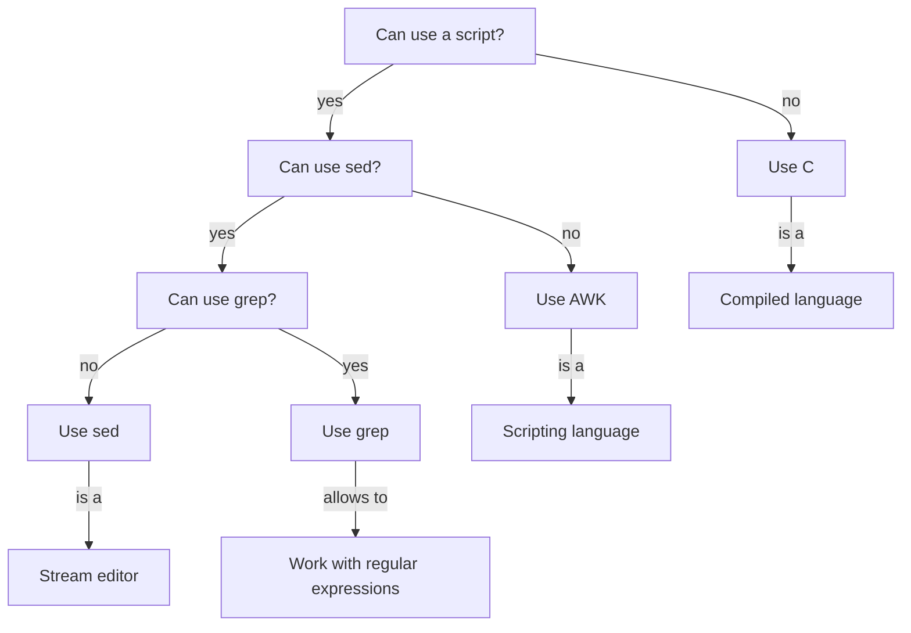

# What is AWK

!!!- info "Learning objectives"

    * .

???- question "For teachers"

    Teaching goals are:

    - .

    Other goals are:

    - .

    Lesson plan:

    * 5 mins: prior knowledge
    * 5 mins: presentation
    * 15 mins: challenge
    * 5 mins: feedback

## Overview

## Exercises

### Exercise procedure

???- info "For teachers"

    > You will be put into Zoom Breakout rooms, in random pairs.
    > One should share his/her screen and do the exercises together on that computer.

    This assures everyone learns effectively: pairs are optimal.

    Check if every room has a screen that is shared!

    > There is no silent room.

    There is no silent room, as:
 
    - (1) working in pairs allows 'Think, Pair, Share' to work; answering is not personal anymore, 
    - (2) getting the experienced learners to teach makes them learn too,
    - (3) this does not work well with Zoom assigning random pairs, 
    - (4) this is not designed to be a self-study course

    > When done with the exercises, go back to the main room

    This helps set the pace of the course. 

    If two-thirds of the learners are back, call back all learners.

    > Breaks are always on the scheduled time. You will be reminded in that chat

    Breaks are important. 

    > Take that break, either in the main room or in your breakout room. The breakout rooms will not be closed

    Do not disrupt the flow (even more) by closing the breakout rooms.

    > In the main room, random learners will be asked questions
    > regarding those exercises.
    > Say the answer you agreed upon as a group (i.e. not your personal answer!)

    This is form is described as 'Think, Pair, Share' in 'The Fundamentals
    of Teaching' by Mike Bell

- You will be put into Zoom Breakout rooms, in random pairs.
- There is no silent room.
- One should share his/her screen and do the exercises together on that computer
- When done with the exercises, go back to the main room
- Breaks are always on the scheduled time. You will be reminded in that chat
- Take that break, either in the main room or in your breakout room. The breakout rooms will not be closed
- In the main room, random learners will be asked questions
  regarding those exercises.
  Say the answer you agreed upon as a group (i.e. not your personal answer!)

### Exercise 1: what is AWK?

!!!- info "Learning objectives"

    - to be able to login to Rackham autonomously

Of the 'To Awk Or Not', read:

- [Main page](https://pmitev.github.io/to-awk-or-not/)

This graph may be helpful:

Which of these statements is true?

- AWK is a programming language
- AWK is an interpreted programming language
- AWK is a compiled programming language
- AWK works on text files
- AWK works on images
- AWK works on `.docx` files
- The programming language AWK can be spelled as Awk too
- The programming language AWK can be spelled as `awk` too

???- info "Solutions"

    - AWK is a programming language

    Yes.

    - AWK is an interpreted programming language

    Yes. For example, `gawk` is an AWK interpreter.

    - AWK is a compiled programming language

    No.

    However, in the past it was! For example, `awka` and `tawk` were AWK compilers.
    Due to this, most people will say AWK is not a compiled programming language.

    C, C++, Fortran, Go and Rust are better examples of a compiled programming language.

    - AWK works on text files

    Yes.

    - AWK works on images

    No: AWK works best on text files. 

    However, some image files, such as SVG, are text-based. 
    This means that AWK *can* work on those images.

    - AWK works on `.docx` files

    No: AWK works best on text files. A `.docx` files is zipped, 
    hence has binary data

    - The programming language AWK can be spelled as Awk too

    No. Where 'AWK' means the programming language, 'Awk'
    is used in a context with something else. For example,
    'GNU Awk' is the name for the GNU implementation of AWK.

    - The programming language AWK can be spelled as `awk` too

    No. Where 'AWK' means the programming language, `awk`
    is the name of a program called `awk`, 
    which is an AWK interpreter

### Exercise 2: load the Python module

!!!- info "Learning objectives"

    - to be able to load a Python version autonomously

Load Python version 3.10.8. 
This is described at the UPPMAX pages on Python [here](http://docs.uppmax.uu.se/software/python/).

### Exercise 3: write a 'Hello world' program

!!!- info "Learning objectives"

    - to be able to run a minimal Python program autonomously

Start Python and write a 'Hello world' program.
This is described at the UPPMAX pages on Python programming [here](http://docs.uppmax.uu.se/software/python_programming/#use-the-python-interpreter)
