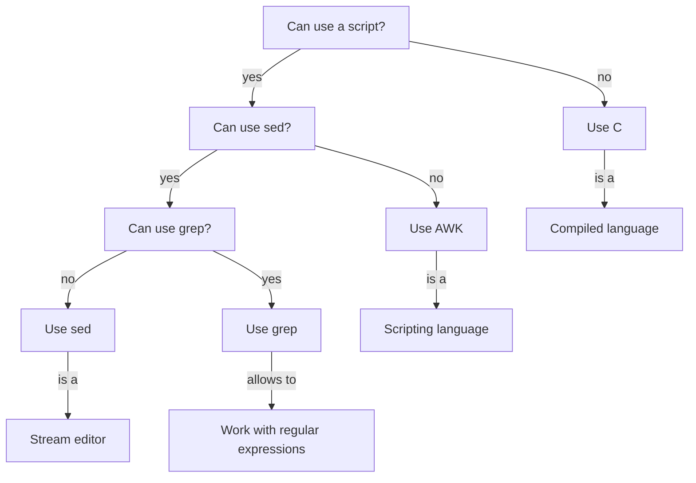

# When to use AWK

!!!- info "Learning objectives"

    - .

???- question "For teachers"

    Teaching goals are:

    - The learners get an idea what AWK is
      - The learners connect AWK with something they know
      - The learners know the difference between the words AWK, Awk and `awk`
    - The learners get an idea when to use AWK

    Other goals are:

    - .

    Lesson plan:

    * 5 mins: prior knowledge
    * 5 mins: presentation
    * 15 mins: challenge
    * 5 mins: feedback

## Overview

In this session, we learn about AWK.

## Exercises

### Exercise procedure

???- info "For teachers"

    > You will be put into Zoom Breakout rooms, in random pairs.
    > One should share his/her screen and do the exercises together on that computer.

    This assures everyone learns effectively: pairs are optimal.

    Check if every room has a screen that is shared!

    > There is no silent room.

    There is no silent room, as:
 
    - (1) working in pairs allows 'Think, Pair, Share' to work; answering is not personal anymore, 
    - (2) getting the experienced learners to teach makes them learn too,
    - (3) this does not work well with Zoom assigning random pairs, 
    - (4) this is not designed to be a self-study course

    > When done with the exercises, go back to the main room

    This helps set the pace of the course. 

    If two-thirds of the learners are back, call back all learners.

    > Breaks are always on the scheduled time. You will be reminded in that chat

    Breaks are important. 

    > Take that break, either in the main room or in your breakout room. The breakout rooms will not be closed

    Do not disrupt the flow (even more) by closing the breakout rooms.

    > In the main room, random learners will be asked questions
    > regarding those exercises.
    > Say the answer you agreed upon as a group (i.e. not your personal answer!)

    This is form is described as 'Think, Pair, Share' in 'The Fundamentals
    of Teaching' by Mike Bell

- You will be put into Zoom Breakout rooms, in random pairs.
- There is no silent room.
- One should share his/her screen and do the exercises together on that computer
- When done with the exercises, go back to the main room
- Breaks are always on the scheduled time. You will be reminded in that chat
- Take that break, either in the main room or in your breakout room. The breakout rooms will not be closed
- In the main room, random learners will be asked questions
  regarding those exercises.
  Say the answer you agreed upon as a group (i.e. not your personal answer!)

### Exercise 1: when to use AWK?

!!!- info "Learning objectives"

    - to understand when to use AWK
    - to practice with the differences between `awk`, `sed` and `grep`

Read ['To Awk Or Not'](https://pmitev.github.io/to-awk-or-not/):

- Main page

This graph puts the same info into another perspective:

