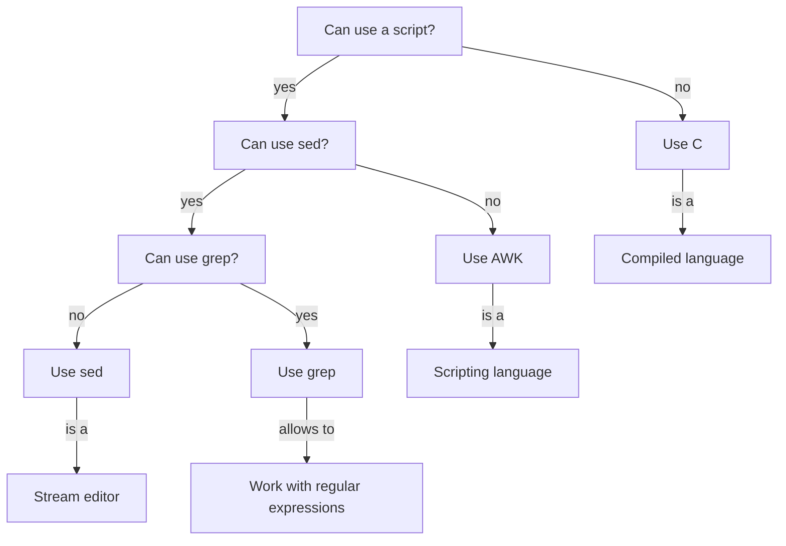

# When to use AWK

!!!- info "Learning objectives"

    - Hear about the tools similar to `awk`

???- question "For teachers"

    Teaching goals are:

    - Show the tools similar to `awk`

    Lesson plan:

    * 5 mins: prior knowledge
    * 5 mins: presentation
    * ? mins: challenge
    * 5 mins: feedback

## Overview

In this session, we learn about the tools similar to `awk`.

## Exercises

See the exercise procedure [here](../misc/exercise_procedure.md).

### Exercise 1: when to use AWK?

!!!- info "Learning objectives"

    - Hear about the tools similar to `awk`

Read ['To Awk Or Not'](https://pmitev.github.io/to-awk-or-not/):

- Main page, quote at the top

This graph puts the same quote into another perspective:



However, without knowing what these tools do, this wisdom is lost on us.

Read the following text, skip terms you do not yet know:

- [The Wikipedia page about AWK](https://en.wikipedia.org/wiki/AWK), abstract only
- [The Wikipedia page about sed](https://en.wikipedia.org/wiki/Sed), abstract only
- [The Wikipedia page about grep](https://en.wikipedia.org/wiki/Grep), abstract only

Here is an overview of tools similar to `awk`, what they are and where they shine:

Tool                                      |Description (as copied from their Wikipedia page)                                                                 |Shines when
------------------------------------------|------------------------------------------------------------------------------------------------------------------|----------------------------------
[AWK](https://en.wikipedia.org/wiki/AWK)  |a domain-specific language designed for text processing and typically used as a data extraction and reporting tool|working with tabular data
[sed](https://en.wikipedia.org/wiki/Sed)  |a Unix utility that parses and transforms text, using a simple, compact programming language                      |replace a regular expression
[grep](https://en.wikipedia.org/wiki/Grep)|a command-line utility for searching plain-text data sets for lines that match a regular expression               |searching for regular expressions

Does the wisdom make sense now?

## Similarities by example

Here we show the similarities of `awk`, `grep` and `sed`.

In this example, we use a file called [coins.txt](https://pmitev.github.io/to-awk-or-not/data/coins.txt):

```title="coins.txt"
gold     1    1986  USA                 American Eagle
gold     1    1908  Austria-Hungary     Franz Josef 100 Korona
silver  10    1981  USA                 ingot
gold     1    1984  Switzerland         ingot
gold     1    1979  RSA                 Krugerrand
gold     0.5  1981  RSA                 Krugerrand
gold     0.1  1986  PRC                 Panda - silver lined
silver   1    1986  USA                 Liberty dollar
gold     0.25 1986  USA                 Liberty 5-dollar piece
silver   0.5  1986  USA                 Liberty 50-cent piece
silver   1    1987  USA                 Constitution dollar
gold     0.25 1987  USA                 Constitution 5-dollar piece
gold     1    1988  Canada              Maple Leaf
```

The goal is to extract all lines that contain the word `silver`.

These statements, use the different tools, do exactly the same:

```
awk "/silver/" coins.txt
grep "silver" coins.txt
sed -n "/silver/p" coins.txt
```

`awk` starts to shine when the thing you want to do is more
complex then detecting lines with a text.

## Links

 * [Book 'CLI text processing with GNU awk'](https://learnbyexample.github.io/learn_gnuawk/)
