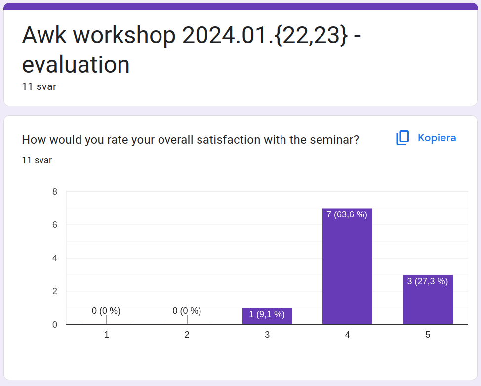
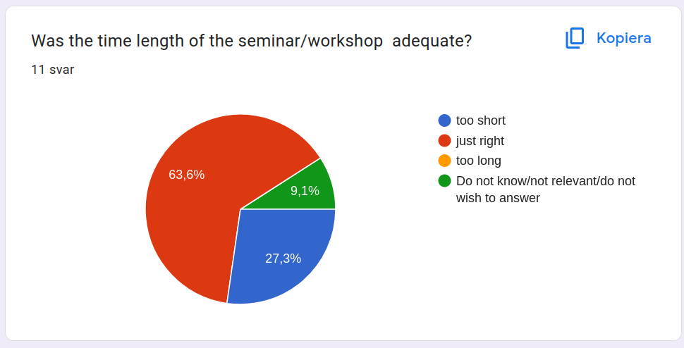
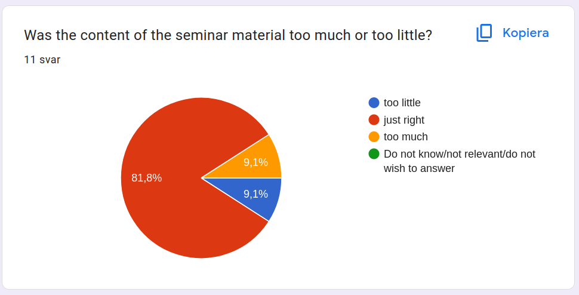
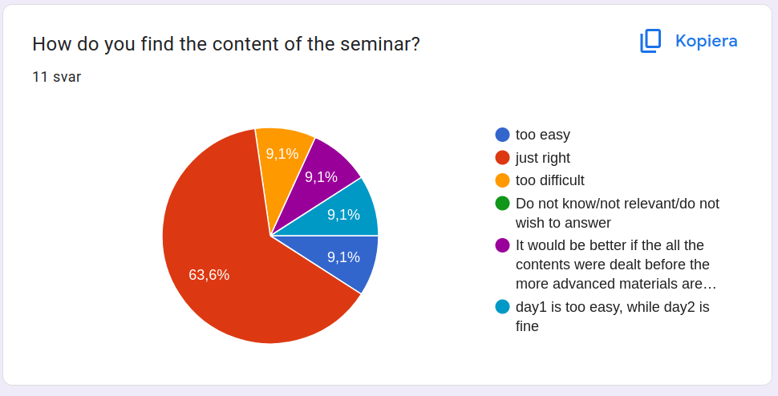
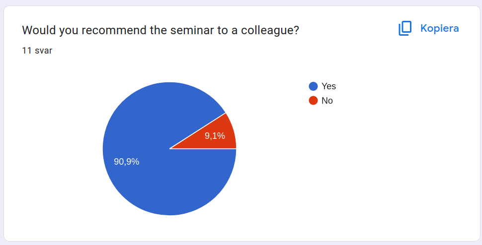
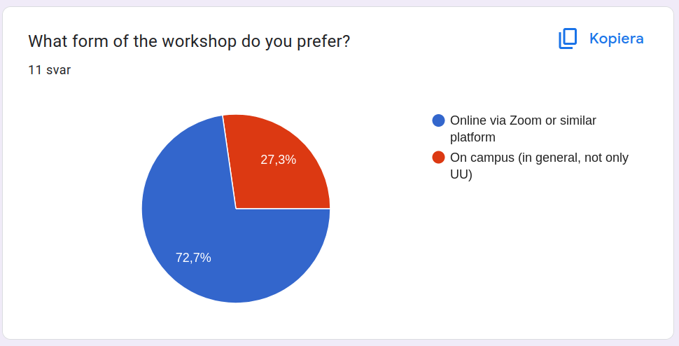
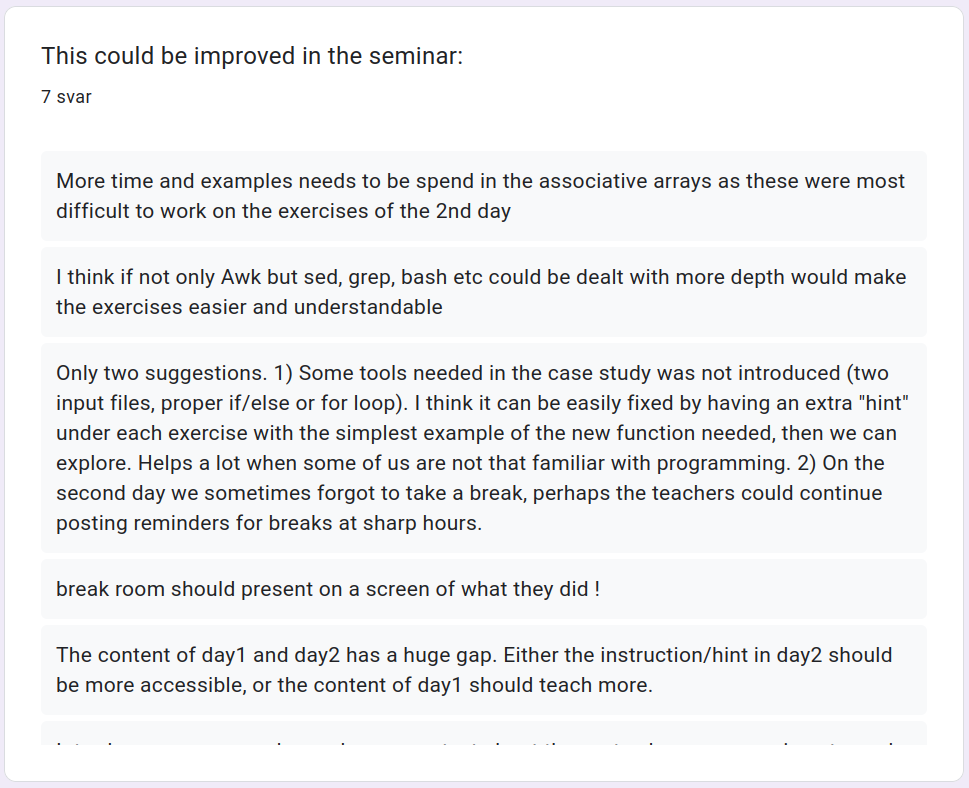
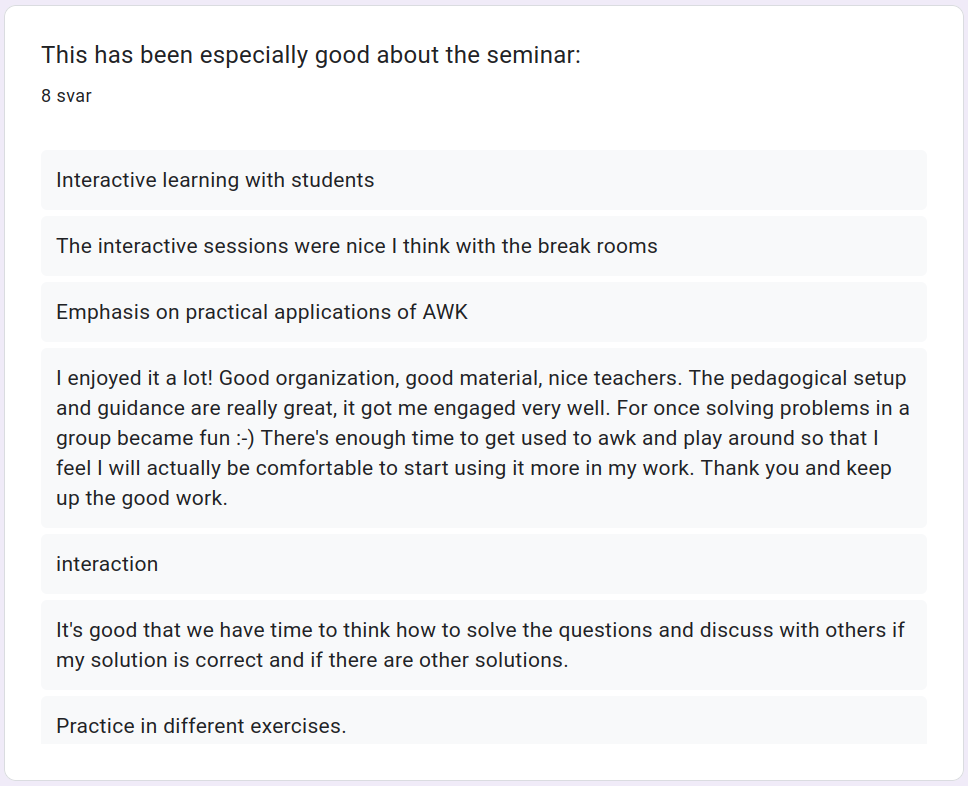

# Evaluations

## From email

> I want to say that, at least the first day, 
> the course was very intense and useful. 
> And as a contribution I would say that in my case 
> I would like a little more context of the syntax before the exercises. 
> Beyond that, in my opinion the course is very well structured.

## From Google Form

### This could be improved in the seminar

 * 7 answers

More time and examples needs to be spend in the associative arrays as these were most difficult to work on the exercises of the 2nd day

I think if not only Awk but sed, grep, bash etc could be dealt with more depth would make the exercises easier and understandable 

Only two suggestions. 1) Some tools needed in the case study was not introduced (two input files, proper if/else or for loop). I think it can be easily fixed by having an extra "hint" under each exercise with the simplest example of the new function needed, then we can explore. Helps a lot when some of us are not that familiar with programming. 2) On the second day we sometimes forgot to take a break, perhaps the teachers could continue posting reminders for breaks at sharp hours.

break room should present on a screen of what they did !

The content of day1 and day2 has a huge gap. Either the instruction/hint in day2 should be more accessible, or the content of day1 should teach more. 

Introduce some examples and more context about the syntax language previous to each exercise

I missed a separate file with used commands so that I could store them somewhere and return to them in the future. However, I could not attend the second day and this may have been done then.

### This has been especially bad about the seminar

- 5 answers

For 2nd day course for any of the solutions indicated, I believe that they should have been first shown as example (either within the previous 1st day material) or beginning of 2nd day.

Nothing!

If most students don't know a specific skill that is necessary to solve the questions in practice, then the discuss is meaningless. If I need to google it, I don't need to join the class. 

There wasn't much context or time to analyse the syntax of the exercises, especially the more difficult ones.

Because I copied the commands we were using and read the meaning of the commands online, I miss my own notes or at least a list of used commands in a separate file where I could keep them. I could not attend the second day though, so perhaps this was done on the second day.

### This has been especially good about the seminar

- 8 answers

Interactive learning with students

The interactive sessions were nice I think with the break rooms 

Emphasis on practical applications of AWK

I enjoyed it a lot! Good organization, good material, nice teachers. The pedagogical setup and guidance are really great, it got me engaged very well. For once solving problems in a group became fun :-) There's enough time to get used to awk and play around so that I feel I will actually be comfortable to start using it more in my work. Thank you and keep up the good work.

interaction

It's good that we have time to think how to solve the questions and discuss with others if my solution is correct and if there are other solutions. 

Practice in different exercises.

I liked that the exercises where explained online on a website so that I could read their meaning in my own tempo.
