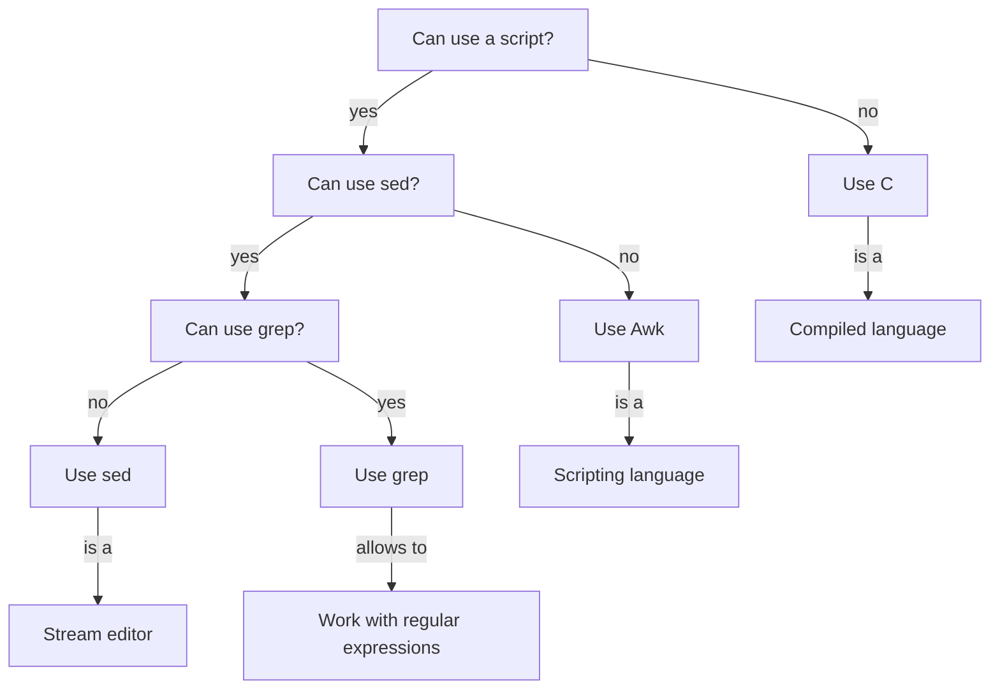

# Lesson plan

- Awk
- Teacher: Richel
- Day: Monday 2024-01-22

Teaching goals:

- Learners feel that Awk is something they can do
- Learners work in small groups
- Learners have enough breaks
- Practice to use the fundamental teaching cycle (as discussed in Mike Bell's 'The 
   Fundamentals of Teaching': (1) prior knowledge,
   (2) presentation, (3) challenge, (4) feedback, (5) repetition

Non-goals:

- Discuss as many Awk concepts as possible,
  instead follow the group's pace
- Stick to the schedule about Awk theory,
  instead follow the group's pace
- Practice Awk theory enough to master it,
  instead follow the group's pace
- Tailor to advanced Awk developers,
  instead follow the beginners' pace 
  and let the more advanced learners help
- Teach best practices,
  instead show those best practices
- Use teaching materials developed by colleagues just to be nice.
  Instead, use free-online teaching materials developed by others,
  so that me and my colleagues do not need to maintain it
- Learners have used a free and online book they can use for future reference.
  Pavlin's material is too nice!

Negative feedback that I will enjoy and not respond to:

- 'The course goes too slow': this is an introduction, aimed at beginners.
  The more advanced learners inevitably will find it go too slow.
- 'Lectures are too short' or 'The contents should be taught': 
  strategic learners will prefer passive listening
  over active teaching methods. Although listening is an activity that
  strategic learners appreciate, it has a too small effect for transferring knowledge.
  I will not feel sorry for putting my learners to work :-)
- 'Go more in-depth': this is an introduction, aimed at beginners,
  so I cover the basics and we get stuff to run. I will go as deep as time
  permits me.
- 'Breaks interrupt the flow': I agree it does. Still, breaks are
  important. And if you feel interrupted in a flow, it is nice to feel
  you like to continue

Negative feedback that I will respond to:

- 'The course goes too fast': this is an introduction, aimed at beginners.
  If even the beginners need more time, I must slow down

## Schedule

In teaching cycles:

- What is Awk?

