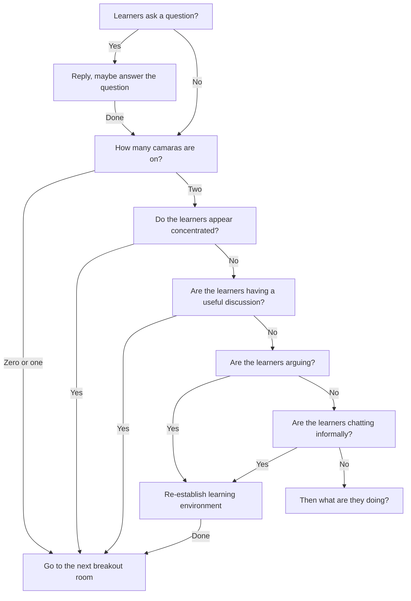

# Lesson plan

- AWK
- Teacher: Richel
- Day: Monday 2024-01-22

Teaching goals:

- Learners feel that AWK is something they can do
- Learners without a Linux background can follow
- Learners work in small groups
- Learners have enough breaks
- Practice to use the fundamental teaching cycle (as discussed in Mike Bell's 'The 
   Fundamentals of Teaching': (1) prior knowledge,
   (2) presentation, (3) challenge, (4) feedback, (5) repetition

Non-goals:

- Discuss as many AWK concepts as possible,
  instead follow the group's pace
- Stick to the schedule about AWK theory,
  instead follow the group's pace
- Practice AWK theory enough to master it,
  instead follow the group's pace
- Tailor to advanced AWK developers,
  instead follow the beginners' pace 
  and let the more advanced learners help
- Teach best practices,
  instead show those best practices
- Use teaching materials developed by colleagues just to be nice.
  Instead, use free-online teaching materials developed by others,
  so that me and my colleagues do not need to maintain it
- Discuss the history of AWK
- Start from `sed` and `grep`

Negative feedback that I will enjoy and not respond to:

- 'The course goes too slow': this is an introduction, aimed at beginners.
  The more advanced learners inevitably will find it go too slow.
- 'Lectures are too short' or 'The contents should be taught': 
  strategic learners will prefer passive listening
  over active teaching methods. Although listening is an activity that
  strategic learners appreciate, it has a too small effect for transferring knowledge.
  I will not feel sorry for putting my learners to work :-)
- 'Go more in-depth': this is an introduction, aimed at beginners,
  so I cover the basics and we get stuff to run. I will go as deep as time
  permits me.
- 'Breaks interrupt the flow': I agree it does. Still, breaks are
  important. And if you feel interrupted in a flow, it is nice to feel
  you like to continue

Negative feedback that I will respond to:

- 'The course goes too fast': this is an introduction, aimed at beginners.
  If even the beginners need more time, I must slow down

## Ideas

I claim:

```
There is no resource on AWK that is 
- (1) free
- (2) online
- (3) has exercises
- (4) assumes no Linux experience
```

So, I ended up to make up all course material.

## Helper instructions

The goal of going through the rooms is to see
that learning can take place and is taking place.

- Q: What is the purpose of visiting the breakout rooms?
- A: To check if the learners can work and do so in a welcoming way
- Q: If, in a breakout room, the learners appear to be concentrated, what do you do?
- A: Do not disturb and move to the next breakout room: you've seen they can work
- Q: If, in a breakout room, two learners are discussing something. They, however, have reached a wrong conclusion. What do you do?
- A: Do not disturb and move to the next breakout room: you've seen they can work
- Q: If, in a breakout room, two learners have an unfriendly argument, what do you do?
- A: Do something about this. This is up to you. Either handle this yourself or ask me to take care of it. Always let me know
- Q: If, in a breakout room, two learners are discussing Pokemon, what do you do?
- A: Do something about this to set them back to work in a friendly way
- Q: If, in a breakout room, only one learner has no camera, what do you do?
- A: Do not disturb and move to the next breakout room: you have no evidence they cannot work
- Q: If, in a breakout room, both learners have no camera, what do you do?
- A: Do not disturb and move to the next breakout room: you have no evidence they cannot work
- Q: If, in a breakout room, one or both learners ask a question to you. What do you do?
- A: Determine if you should answer: have they discussed together already? If yes, help them arrive at finding the right answer. Only give a direct answer as a last option



## Schedule

- Present 'Who is Richel'
- Poll: Who knows what grep is?
- Poll: Who knows what sed is?
- Start cycles


